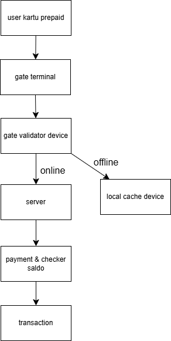
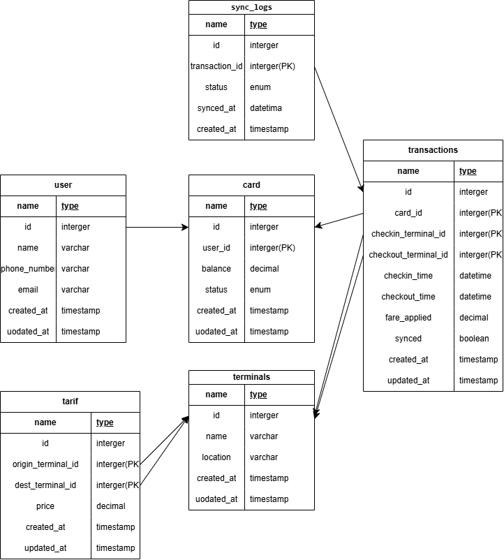

# E-Ticketing System

Sistem E-Ticketing untuk transportasi publik menggunakan Golang, Echo, PostgreSQL, dan JWT.

## Topologi Sistem

Berikut adalah gambar topologi sistem:

## ERD (Entity Relationship Diagram)

Struktur database digambarkan melalui ERD berikut:

## 🔧 Teknologi yang Digunakan

- Golang (Echo framework)
- PostgreSQL
- JWT (JSON Web Token)
- Docker